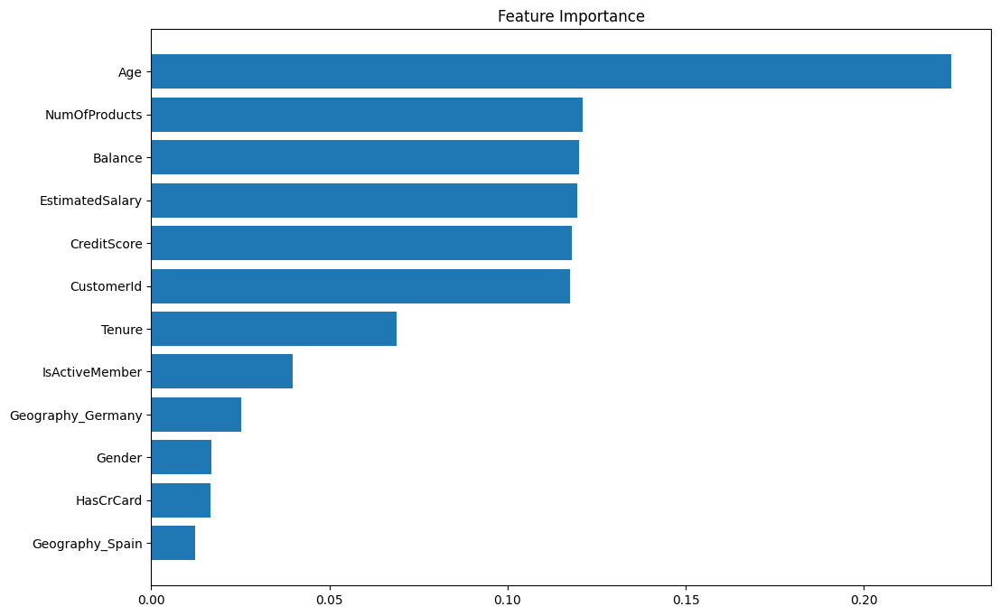
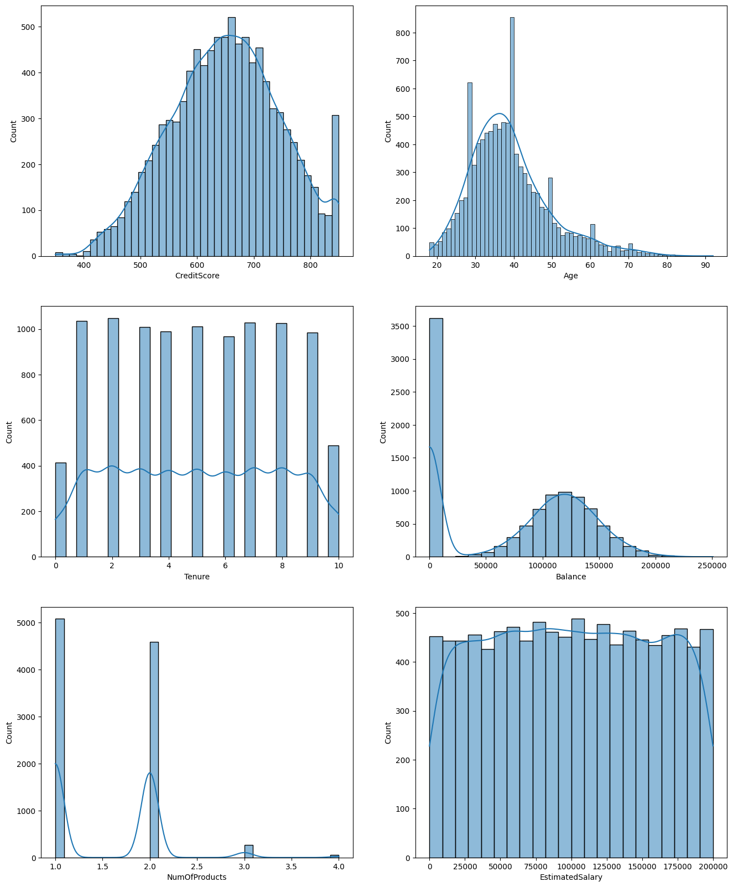
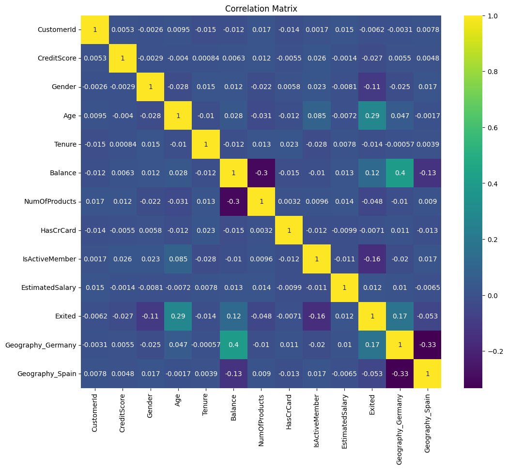

# Churn Prediction Model with Random Forest Algorithm and Linear Regression

### Overview:
Customer churn is a critical issue for businesses, as losing customers directly impacts revenue and profitability. The goal of this project was to build a predictive model that accurately identifies customers at risk of churning. By anticipating customer attrition, businesses can take proactive measures to retain valuable customers, reduce churn rates, and enhance customer satisfaction.

### Results
- Random Forest Algorithm performs better than Linear Regression Model with an 86% accuracy in predicting customer churn.
- Key Insight: The Age attribute had the highest feature importance, indicating that younger customers were more likely to churn.

### Technical Components
 - **Libraries Used:** Python (Pandas, NumPy, Scikit-learn, Matplotlib, Seaborn)
 - **Data Preprocessing:**
    - Handled missing values
    - Normalized numerical features
    - One-hot encoded categorical variables (Gender, Geography)
  
- **Models Implemented:**
    - Random Forest Classifier
    - Linear Regression Model
- **Feature Importance Analysis:** Identified key drivers of churn using model interpretability techniques.
  

### KPIs in Place
**Model Accuracy:** Random Forest (86%) vs. Linear Regression (81%)  
**Precision & Recall:** Evaluated model effectiveness in correctly identifying churned customers.  
**Feature Importance Score:** Determined the most influential factors driving customer churn.  
**Reduction in Churn Rate:** Potential impact of implementing predictive churn prevention strategies.  

### Best Practices Implemented
✔ **Balanced the Dataset:** Addressed class imbalance to improve model performance.  
✔ **Feature Engineering:** Applied label encoding, normalization, and dummy variables for improved accuracy. 
✔ **Model Comparison:** Evaluated multiple algorithms to determine the best-performing model. 
✔ **Hyperparameter Tuning:** Optimized Random Forest parameters for better predictive power. 
✔ **Interpretability:** Used feature importance analysis to provide actionable insights. 

### Lessons Learned
📌 **Random Forest Outperforms Linear Regression:** Tree-based models handle complex interactions better, leading to higher accuracy.  
📌 **Feature Importance Matters:** Age, Credit Score, and Account Balance significantly impact churn likelihood.  
📌 **Data Preprocessing is Critical:** Encoding categorical variables and normalizing numerical features improved model performance.  
📌 **Next Steps:**
  - Implement a real-time monitoring system for churn prediction.
  - Use more advanced models (e.g., XGBoost, Neural Networks) to improve accuracy.
  - Deploy the model as an API for business integration.

